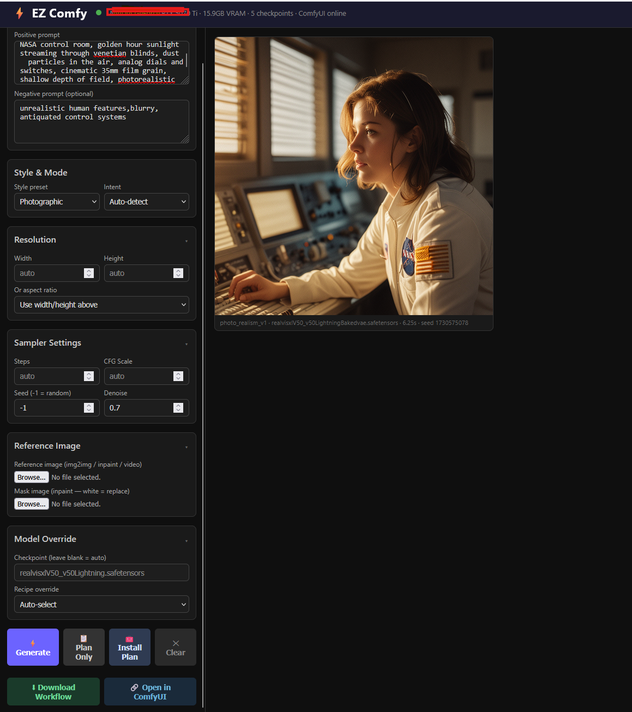

# EZ Comfy

[](https://python.org)
[](LICENSE)
[](tests/)
[](https://github.com/comfyanonymous/ComfyUI)
[]()

> **ComfyUI is incredibly powerful — and incredibly complex.** EZ Comfy sits in front of it so you don't have to.

EZ Comfy is a hardware-aware orchestration layer for [ComfyUI](https://github.com/comfyanonymous/ComfyUI). You type a prompt. It figures out the rest: which model fits your GPU, which workflow to use, what parameters to apply, and how to adapt your prompt for the model you're running.

No node graphs. No hunting through documentation. No VRAM surprises.


<!-- Screenshot: open http://127.0.0.1:7860, type a prompt, generate, capture the result. Save as assets/screenshot-ui.png -->

---

## The Problem

ComfyUI is the most capable local image generation tool available. Its node-based workflow system gives you complete control over every step of the diffusion pipeline. But that power comes at a cost:

- **Which model should I use?** There are hundreds of checkpoints, each optimized for different tasks, trained on different datasets, requiring different prompt syntax, and demanding different amounts of VRAM.
- **How do I wire the workflow?** A basic txt2img needs ~8 nodes. A hi-res fix pipeline needs ~20. Inpainting adds more. ControlNet more still.
- **What settings?** SDXL Lightning wants 6 steps and CFG 1.5. Flux dev wants 20 steps and CFG 1.0. Wrong settings produce garbage outputs.
- **Why am I running out of VRAM?** Your local LLM is still loaded in GPU memory from your last chat session.

EZ Comfy solves all of this automatically — and tells you exactly what it decided and why.

---

## What EZ Comfy Does

### 1. Selects the best model for your GPU
EZ Comfy maintains a curated catalog of ~50 popular checkpoints, each tagged with VRAM requirements, ideal tasks, strengths, and weaknesses. At startup it scans your ComfyUI installation and your GPU. When you generate, it picks the best installed model for your intent — or tells you exactly what to download if nothing fits.

### 2. Detects intent and selects the right workflow
It classifies your prompt and inputs into a pipeline intent:

| Intent | Triggered by |
|--------|-------------|
| `txt2img` | Text prompt, no input image |
| `img2img` | Reference image + transform prompt |
| `inpaint` | Reference image + mask |
| `upscale` | Upscale/enhance prompt or high-res intent |
| `video` | Animate/video prompt or reference image |
| `audio` | Sound/music/audio prompt |

Then selects from a library of proven workflow recipes (txt2img basic, hi-res fix, photo realism, img2img, ControlNet canny, inpaint, upscale+refine, SVD, Stable Audio) and composes the ComfyUI node graph automatically.

### 3. Adapts prompts for model-specific syntax
Different model families require different prompt syntax. EZ Comfy applies the right rules automatically:

| Family | What it does automatically |
|--------|---------------------------|
| **Pony** (SDXL-based) | Prepends `score_9, score_8_up, score_7_up` — required for quality output |
| **Flux** | Strips `(word:1.3)` emphasis weights; suppresses negative prompt (Flux ignores negatives) |
| **SD 1.5 anime** | Appends `, masterpiece, best quality` quality suffix |
| **SDXL** | Applies standard quality negatives automatically |

Without this, using a Pony model without score tags produces mediocre results, and sending emphasis weights to Flux literally breaks the conditioning.

### 4. Snaps resolution to trained buckets
Arbitrary resolutions produce blurry, distorted results because diffusion models are trained on specific aspect ratios. EZ Comfy always snaps to the nearest trained bucket:

- **SDXL / Flux:** `1024×1024`, `1152×896`, `896×1152`, `1344×768`, `768×1344`, `1536×640`, etc.
- **SD 1.5:** `512×512`, `768×512`, `512×768`, `640×448`, `448×640`, etc.

You can request `1920×1080` and it will snap to `1344×768` — the closest trained ratio.

### 5. Manages VRAM automatically (the Ollama handoff)
If you run a local LLM via [Ollama](https://ollama.com) alongside ComfyUI — common for fully-local AI setups — the two fight over GPU memory. Ollama keeps its model loaded in VRAM even when idle, which can push ComfyUI into an OOM situation mid-generation.

Before every generation, EZ Comfy tells Ollama to evict its model from VRAM, runs the generation, then tells ComfyUI to free its memory on completion. Ollama reloads lazily on the next LLM request. No manual intervention, no OOM errors.

```
┌── Generation start ──────────────────────────────────────┐
│  1. POST ollama /api/generate {keep_alive: 0}  ← evict   │
│  2. Acquire GPU lock                                      │
│  3. Run ComfyUI workflow                                  │
│  4. POST comfyui /free                         ← cleanup  │
│  5. Release GPU lock                                      │
└───────────────────────────────────────────────────────────┘
```

### 6. Exports workflows to ComfyUI — with full provenance
Every planned generation can be downloaded as a ComfyUI-compatible API workflow JSON. A **Download Workflow** button in the web UI lets you grab the generated node graph and drag it into ComfyUI's canvas — great for using EZ Comfy to find the right setup, then hand-tuning it in the full interface.

When you export, EZ Comfy injects a **Note node** directly into the workflow that documents every automated decision:

```
EZ Comfy Provenance
═══════════════════════════════════════════════════════════
GPU           NVIDIA GeForce RTX 5070 Ti  (15.9 GB VRAM)
Model         realvisxlV50_v50LightningBakedvae.safetensors
Family        sdxl_lightning
Recipe        photo_realism_v1
═══════════════════════════════════════════════════════════
DECISIONS
intent         txt2img        (recommendation)
               Why: detected keyword 'portrait' → txt2img
checkpoint     realvisxlV50…  (recommendation, score 99.8)
               Why: best installed match for photorealism, portraits; VRAM fits
recipe         photo_realism… (recommendation)
               Why: best match for photorealism intent
steps          6              (model_catalog)
               Why: catalog default for sdxl_lightning
cfg            1.5            (model_catalog)
               Why: catalog default for sdxl_lightning
sampler        euler          (model_catalog)
resolution     1024×1024      (family_profile)
seed           1678564476     (random)
═══════════════════════════════════════════════════════════
Alternatives considered:
  checkpoint: DreamShaper 8 (score 75.0) — lower score than winner
  checkpoint: SDXL Base 1.0 (score 70.8) — lower score than winner
```

This note travels with the workflow — when you open it in ComfyUI, you can see exactly what EZ Comfy decided and why, making the handoff to power-user mode fully transparent.

### 7. Provenance panel in the web UI
After every Plan or Generate, the web UI shows a **What EZ Comfy decided for you** panel with:
- The chosen model, recipe, and intent
- Every parameter decision and its source (`user` / `recommendation` / `model_catalog` / `family_profile` / `random` / etc.)
- Alternatives that were considered and rejected, with reasons

### 8. Sidecar metadata files
After each generation, EZ Comfy writes a JSON sidecar to `{output_dir}/ez_comfy_meta/{prompt_id}.json` containing the full provenance record, GPU context, timing, and output file list. Retrieve it later via `GET /v1/history/{prompt_id}/provenance`.

---

## Quick Start

### Requirements
- Python 3.11+
- [ComfyUI](https://github.com/comfyanonymous/ComfyUI) running locally (default: `http://127.0.0.1:8188`)
- At least one model checkpoint installed in ComfyUI
- NVIDIA GPU (CPU generation not tested)

### Install

```bash
git clone https://github.com/KarloffsGhost/ez-comfy
cd ez-comfy
pip install -e ".[dev]"
```

### Configure

```bash
cp config/settings.example.yaml config/settings.yaml
# Optional: edit config/settings.yaml only if auto-detect cannot find ComfyUI
```

By default, EZ Comfy auto-detects a local ComfyUI install. It probes common
localhost ports (`8188`, `8000`, `8189`, `8001`) and reads the ComfyUI Desktop
model-path config when available. Manual `base_url` and `model_base_path`
settings still take priority when you set them.

### Check your setup

```bash
python -m ez_comfy check
```

Output:
```
Detected ComfyUI at http://127.0.0.1:8188 (source: probe)
GPU     : NVIDIA GeForce RTX 4070  (12.0 GB VRAM)
RAM     : 32.0 GB
Platform: win32

Scanning inventory …
Checkpoints : 7
  • realvisxlV50_v50Lightning.safetensors  [sdxl]  6.6GB
  • dreamshaper_8.safetensors  [sd15]  2.1GB
  … and 5 more
LoRAs       : 3
Capabilities: ['ControlNetLoader', 'IPAdapterModelLoader', ...]
```


### Generate from the command line

```bash
python -m ez_comfy generate "a cyberpunk city at sunset, cinematic lighting"
```

### Use the web UI

```bash
python -m ez_comfy serve --port 7860
# Open http://127.0.0.1:7860
```


### Preview what would happen (no GPU used)

```bash
python -m ez_comfy plan "a portrait of an astronaut"
```


### See model recommendations

```bash
python -m ez_comfy recommend "photorealistic portrait"
```

---

## Configuration

Copy `config/settings.example.yaml` to `config/settings.yaml` if you want local
overrides. The defaults auto-detect ComfyUI, so a config file is optional for
standard local installs:

```yaml
comfyui:
  auto_detect: true
  # base_url: "http://127.0.0.1:8188"      # Optional manual override
  # model_base_path: "/path/to/ComfyUI/models"
  output_dir: "output"                    # ComfyUI output directory (for sidecar metadata)

ollama:
  base_url: "http://localhost:11434"
  enabled: true                            # Set false if you don't use Ollama

preferences:
  prefer_speed: true                       # Prefer faster model variants (Lightning/Turbo)
  auto_negative_prompt: true               # Auto-generate negatives per model family
```

**Environment variable overrides** (useful for Docker / CI):

| Variable | Description |
|----------|-------------|
| `EZCOMFY_COMFYUI_URL` | ComfyUI base URL |
| `EZCOMFY_OLLAMA_URL` | Ollama base URL |
| `EZCOMFY_MODEL_BASE` | Model directory path |
| `EZCOMFY_CONFIG` | Path to config YAML file |

---

## CLI Reference

```
ez-comfy [--config FILE] [--verbose]

  check                       Health check + show GPU + ComfyUI inventory
  plan      PROMPT            Preview generation plan without using GPU
  recommend PROMPT            Show ranked model recommendations
  generate  PROMPT            Generate image/audio/video
  serve                       Start web UI + REST API server

generate options:
  --negative TEXT             Negative prompt
  --intent TEXT               Override intent (txt2img|img2img|inpaint|upscale|video|audio)
  --checkpoint TEXT           Override checkpoint filename
  --recipe TEXT               Override workflow recipe ID
  --reference FILE            Reference image (for img2img/inpaint/video)
  --width INT                 Output width (snapped to bucket)
  --height INT                Output height (snapped to bucket)
  --steps INT                 Override sampling steps
  --seed INT                  Seed (-1 = random)
  --denoise FLOAT             Denoise strength for img2img (default: 0.7)
  --timeout FLOAT             Generation timeout in seconds (default: 300)

serve options:
  --host TEXT                 Bind host (default: 127.0.0.1)
  --port INT                  Port (default: 7860)
```

---

## Web API

The server exposes a REST API. Interactive docs at `http://127.0.0.1:PORT/docs`.

| Method | Endpoint | Description |
|--------|----------|-------------|
| `GET` | `/v1/health` | Status, GPU info, ComfyUI connectivity |
| `POST` | `/v1/generate` | Generate synchronously (JSON body) |
| `POST` | `/v1/generate/form` | Generate synchronously (multipart, supports image upload) |
| `POST` | `/v1/queue` | Enqueue generation for background processing |
| `GET` | `/v1/queue` | List all queued/running/completed jobs |
| `GET` | `/v1/queue/{job_id}` | Get job status and result |
| `DELETE` | `/v1/queue/{job_id}` | Cancel a queued job |
| `POST` | `/v1/plan` | Preview generation plan with full provenance (no GPU) |
| `POST` | `/v1/plan/workflow` | Export ComfyUI workflow JSON (with embedded provenance Note node) |
| `GET` | `/v1/history/{prompt_id}/provenance` | Retrieve provenance record for a completed generation |
| `POST` | `/v1/compare` | Run multiple generations for A/B comparison |
| `GET` | `/v1/recommendations` | Ranked model recommendations for a prompt |
| `GET` | `/v1/inventory` | Installed models, LoRAs, capabilities |
| `POST` | `/v1/inventory/refresh` | Re-scan ComfyUI inventory |
| `GET` | `/v1/recipes` | Available workflow recipes |
| `GET` | `/v1/install/plan` | What to install for a given prompt |

### Workflow export provenance levels

`POST /v1/plan/workflow?provenance=<level>`

| Level | Behaviour |
|-------|-----------|
| `summary` *(default)* | Injects a ComfyUI Note node with human-readable provenance. The note travels with the workflow onto the canvas. |
| `full` | Note node + `_ez_comfy_provenance` JSON key in the workflow dict. |
| `none` | Raw workflow with no additions — identical to what EZ Comfy submits to ComfyUI. |

---

## Provenance — How It Works

Every automated decision EZ Comfy makes is recorded as a `Decision` with four fields:

| Field | Description |
|-------|-------------|
| `parameter` | What was decided (e.g. `checkpoint`, `steps`, `resolution`) |
| `chosen_value` | The value that was selected |
| `source` | Why this source had authority (see table below) |
| `reason` | Human-readable explanation |
| `alternatives` | Other values considered and why they were rejected |

**Decision sources** (priority order, highest first):

| Source | Meaning |
|--------|---------|
| `user` | Explicit user override via API/CLI |
| `recommendation` | Best-scoring catalog match for this GPU + intent |
| `capability_fallback` | Downgraded because a required node type isn't installed |
| `prompt_keyword` | Detected from keywords in the prompt |
| `model_catalog` | Catalog-defined default for this checkpoint |
| `family_profile` | Model-family default (e.g. SDXL default resolution) |
| `recipe` | Workflow recipe default |
| `resolution_bucket` | Nearest trained aspect-ratio bucket |
| `fallback` | System default when no better source applies |
| `random` | Randomly generated (seed) |

---

## Architecture

```
ez_comfy/
  api/              FastAPI server, routes, inline HTML/JS UI (no build step)
  hardware/         GPU probe (nvidia-smi) + ComfyUI inventory scanner
  models/           Curated model catalog (~50 entries) + family profiles + classifier
  planner/          Intent detection + prompt adapter + param resolver + plan generator
    provenance.py   ProvenanceRecord, Decision, Alternative dataclasses
  workflows/        Recipe registry + ComfyUI node graph composers (Python dicts)
  comfyui/          HTTP + WebSocket client + VRAM guard context manager
  config/           Pydantic settings schema + YAML loader + env overrides
  engine.py         Top-level orchestrator + GPU-locked generation queue + sidecar writer
  __main__.py       argparse CLI entry point
```

### Request pipeline

```
User prompt
    │
    ▼ Intent detection        txt2img? img2img? upscale? audio?
    │                         → Decision(parameter="intent", source="recommendation"|"prompt_keyword")
    ▼ Model selection         catalog × inventory × VRAM × task scoring
    │                         → Decision(parameter="checkpoint", alternatives=[...rejected...])
    ▼ Recipe selection        workflow template × capability check
    │                         → Decision(parameter="recipe", alternatives=[...rejected...])
    ▼ Prompt adaptation       Pony tags / Flux no-emphasis / auto-negatives
    │                         → Decision(parameter="prompt_adaptation")
    ▼ Parameter resolution    profile → catalog → recipe → user overrides
    │                         → Decision per param with source tag
    ▼ Workflow composition    Python dict → ComfyUI node graph
    │
    ▼ VRAM handoff            unload Ollama → acquire GPU lock
    │
    ▼ Submit to ComfyUI       POST /prompt + WebSocket progress events
    │
    ▼ Result                  image/audio/video + provenance record + sidecar JSON
```

### Key design decisions (for developers)

- **Workflows are Python dicts, not JSON files.** No template I/O at generation time. Node graphs are composed in memory by builder functions.
- **Provenance is structural, not reconstructed.** `ProvenanceRecord` is built incrementally during `plan_generation()` — each decision is recorded at the moment it's made, not inferred after the fact.
- **Note node injection uses ComfyUI's built-in `Note` class_type.** No custom nodes required. The note appears on the canvas when you drag the exported workflow in.
- **Capability-based recipe selection.** Recipes declare required ComfyUI `class_type` names (e.g. `"ControlNetLoader"`). The inventory checks `GET /object_info` at startup to discover what's installed. If a capability is missing, a simpler recipe is chosen and the user is warned.
- **Single GPU lock.** `asyncio.Lock` in `GenerationEngine` ensures no concurrent submissions, regardless of whether the request came from the API, CLI, or the background queue.
- **WebSocket-primary, HTTP polling fallback.** Progress events come from `ws://comfyui/ws`. If the WebSocket fails for any reason, silent fallback to `GET /history` polling.
- **VRAM guard is a context manager.** `async with vram_guard(client, ollama_url)` wraps every generation. The `finally` block always frees ComfyUI VRAM even if generation fails.
- **Sidecar writes are best-effort.** Wrapped in `try/except` so a metadata write failure never aborts a generation.
- **No model downloads.** EZ Comfy shows download instructions (HuggingFace CLI commands, Civitai links) but never downloads files itself.

---

## Adding to the Model Catalog

The catalog lives in `ez_comfy/models/catalog.py` as a Python list of `ModelCatalogEntry` dataclasses:

```python
ModelCatalogEntry(
    id="juggernaut-xl",
    name="Juggernaut XL v9",
    family="sdxl",
    filename="juggernautXL_v9Rundiffusion.safetensors",
    vram_min_gb=6.0,
    tasks=["txt2img", "img2img"],
    strengths=["photorealism", "portraits", "cinematic"],
    weaknesses=["anime", "flat illustration"],
    prompt_syntax=PromptSyntax.STANDARD,
    source="RunDiffusion/Juggernaut-XL-v9",
    download_command="huggingface-cli download RunDiffusion/Juggernaut-XL-v9 juggernautXL_v9Rundiffusion.safetensors",
)
```

---

## Running Tests

```bash
pytest tests/unit/ -v
```

All 232 tests run in under 1 second with no ComfyUI connection required.

---

## Contributing

See [CONTRIBUTING.md](CONTRIBUTING.md).

---

## License

MIT — see [LICENSE](LICENSE).
